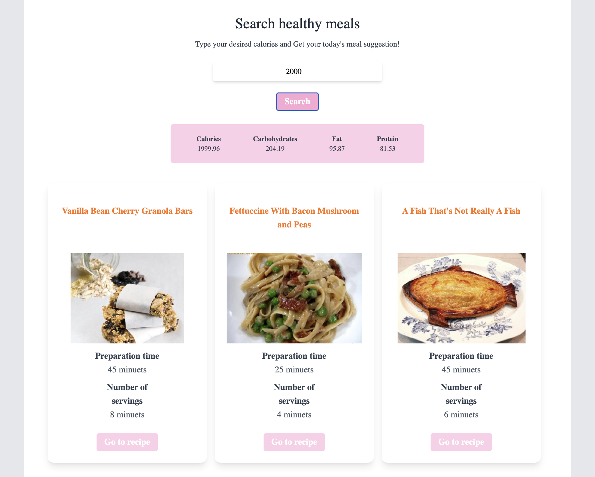
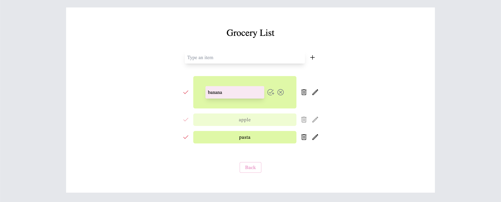

# Cook Helper App

A web application helps users to prepare meals

## Demo Link

- [Cook Helper App](https://meal-idea-generation-react-lbzm7bvj4-hikari7.vercel.app/)

## Built With

- `React` : version 18.2.0
- `tailwindcss` : version 3.0.2

- spooncular API

## Features

The web app has three useful pages for cooking

- Searching menus by grocery name
- Searing menu by calculated calories you expected
- Grocery list (having the edit mode)

All pages were created by React Hooks efficiently.

## Challenging Part

It was the first time to create React App on my own and use Tailwind. Outputting my knowledge helped me to get used to using them surely!

## Setup

- Download or clone the repository
- Run npm install
- Run npm start to start running the app
